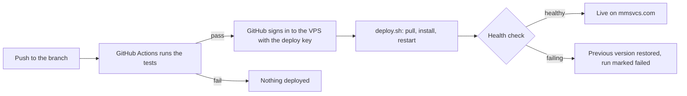

# MM Services — Deployment Guide

How to put the MM Services website (frontend) and its backend and database on a Hostinger VPS
at **https://mmsvcs.com**, and how every push to the `claude/mm-services-website-upm26t` branch
then deploys itself.

The one-time setup takes about an hour. After that, deploying is just pushing to the branch.

---

## How it works

One VPS runs everything:

- **Nginx** answers visitors on HTTPS and passes requests to the app.
- **The Node.js app** (`mm-services-backend/`, kept running by **PM2**) serves the website pages
  from `mm-services-website/`, the form API (`/api`) and the admin dashboard (`/admin`).
- **SQLite** stores quote requests and job applications in one file, `data/mm-services.db`.
  Uploaded resumes are in `data/uploads/`. There is no separate database server.

Automatic deploys:



1. A push that changes `mm-services-website/`, `mm-services-backend/` or the workflow starts the
   **Deploy to VPS** workflow (`.github/workflows/deploy-vps.yml`).
2. It runs the backend tests. If they fail, nothing is deployed.
3. It signs in to the server with a key that can do only one thing: run
   `mm-services-backend/deploy/deploy.sh`.
4. The script pulls the branch, installs dependencies, restarts the app and checks
   `http://127.0.0.1:3000/api/health`. If the new version isn't healthy within 20 seconds, it puts
   the previous version back and the GitHub run is marked failed.

Commands below assume the server user `mm` and the code in `/home/mm/haytrex`. Replace
`YOUR_SERVER_IP` with your server's address everywhere.

---

## Before you start

| What | Used for | Where it comes from |
| --- | --- | --- |
| Hostinger VPS, **KVM 1** plan | Runs the site, backend and database | hostinger.com |
| Admin access to the GitHub repo `MHF0/haytrex` | Adding keys and deploy secrets | Your GitHub account |
| Squarespace access to mmsvcs.com | Pointing the domain at the server | Your Squarespace account |
| SMTP settings for info@mmsvcs.com | Emailing you each new submission | Whoever hosts that mailbox |
| A terminal | Signing in to the server | Mac: Terminal. Windows: PowerShell |
| An admin password (16+ characters) | Logging in to mmsvcs.com/admin | You |

---

## Step 1 — Buy the VPS

1. On Hostinger, choose **KVM 1**.
2. Operating system: **Ubuntu 24.04** (plain OS, no control panel).
3. Data center: a **US** location.
4. Set a strong root password.
5. When it's ready, copy the server's **IP address** from hPanel → VPS → Overview.

If you turn on Hostinger's own firewall in hPanel, allow ports **22, 80 and 443**.

## Step 2 — Prepare the server

From your computer:

```bash
ssh root@YOUR_SERVER_IP
```

Then, as `root`:

```bash
apt update && apt upgrade -y
apt install -y nginx git curl sqlite3 certbot python3-certbot-nginx

# Node.js 22 (the app needs 22.13 or newer for its built-in database)
curl -fsSL https://deb.nodesource.com/setup_22.x | bash -
apt install -y nodejs
node --version

npm install -g pm2

# The app runs as this user, not as root
adduser --disabled-password --gecos "" mm

# Firewall: SSH, HTTP, HTTPS only
ufw allow OpenSSH && ufw allow "Nginx Full" && ufw --force enable
```

## Step 3 — Put the code on the server

The repository is private, so the server gets its own **read-only** key.

As `mm`:

```bash
su - mm
ssh-keygen -t ed25519 -N "" -C "mm-server-read" -f ~/.ssh/id_ed25519
cat ~/.ssh/id_ed25519.pub
```

On GitHub: **MHF0/haytrex → Settings → Deploy keys → Add deploy key**. Title it `VPS read access`,
paste the key, and leave **Allow write access unchecked**.

Back on the server, still as `mm`:

```bash
git clone -b claude/mm-services-website-upm26t git@github.com:MHF0/haytrex.git ~/haytrex
```

Type `yes` when asked to trust github.com. The server always deploys the branch it has checked out.

## Step 4 — Configure the app

As `mm`:

```bash
cd ~/haytrex/mm-services-backend
cp .env.example .env
openssl rand -hex 32        # copy the output for SESSION_SECRET
nano .env                   # save: Ctrl+O, Enter. Exit: Ctrl+X
chmod 600 .env
```

| Setting | What to put |
| --- | --- |
| `ADMIN_PASSWORD` | Your admin password |
| `SESSION_SECRET` | The output of `openssl rand -hex 32` |
| `NOTIFY_EMAIL` | Where new submissions are emailed (info@mmsvcs.com) |
| `SMTP_HOST`, `SMTP_PORT` | Your mail provider's outgoing server, e.g. `smtp.hostinger.com` / `465`, or `smtp.gmail.com` / `465` |
| `SMTP_USER`, `SMTP_PASS` | The mailbox login (Gmail/Google Workspace: an app password) |
| `SMTP_FROM` | Sender shown on notifications |

Leave the other settings as they are. Without SMTP settings, submissions are still saved and shown
in the dashboard; they just aren't emailed.

## Step 5 — First deploy

As `mm`:

```bash
~/haytrex/mm-services-backend/deploy/deploy.sh
```

It should end with `==> Live: <commit> is healthy on port 3000`.

Make the app start again after a server reboot. This needs **root**: type `exit` until your
prompt starts with `root@` instead of `mm@`, then run:

```bash
pm2 startup systemd -u mm --hp /home/mm
```

## Step 6 — Point mmsvcs.com at the server

In Squarespace: **Domains → mmsvcs.com → DNS → DNS settings**.

| Type | Host | Value |
| --- | --- | --- |
| A | @ | YOUR_SERVER_IP |
| A | www | YOUR_SERVER_IP |

Delete any other A, AAAA or CNAME records for `@` and `www`.
**Do not change MX or TXT records** — they deliver email for info@mmsvcs.com.

> The domain currently points to an IONOS server (74.208.236.20). If Squarespace's DNS page says
> **"You're using custom nameservers"**, the records on that page are not live: DNS is run by whichever
> provider those nameservers belong to. Make the changes there instead. Or switch the domain to
> Squarespace nameservers, but only after recreating the old provider's email records (MX and TXT) in
> Squarespace, or email for info@mmsvcs.com stops working.

Then check from the server (as root). Wait until both `A` lines show only your server's IP and both
`AAAA` lines are empty. This usually takes minutes, occasionally a few hours. `ping` alone isn't enough:
it ignores AAAA (IPv6) records, but Let's Encrypt checks them first.

```bash
apt install -y dnsutils
for h in mmsvcs.com www.mmsvcs.com; do for t in A AAAA; do echo "$h $t: $(dig +short $t $h @1.1.1.1)"; done; done
```

## Step 7 — Nginx and HTTPS

Every command here needs **root**: your prompt must start with `root@`, not `mm@` (type `exit` to
get back to root). Run the Certbot line only once DNS points at the server.

```bash
cp /home/mm/haytrex/mm-services-backend/deploy/nginx-mmsvcs.conf /etc/nginx/sites-available/mmsvcs.conf
ln -sf /etc/nginx/sites-available/mmsvcs.conf /etc/nginx/sites-enabled/mmsvcs.conf
rm -f /etc/nginx/sites-enabled/default
nginx -t && systemctl reload nginx

certbot --nginx -d mmsvcs.com -d www.mmsvcs.com --redirect --agree-tos -m info@mmsvcs.com --no-eff-email
```

The site is now live at https://mmsvcs.com and the dashboard at https://mmsvcs.com/admin.
The certificate renews itself. The admin login works only over HTTPS, so log in after this step.

## Step 8 — Turn on automatic deploys

GitHub needs three secrets: a key to sign in to the server, the server's address, and the server's
fingerprint (so GitHub can't be tricked into deploying to an impostor server).

**8a. Create the deploy trigger key.** As `mm`:

```bash
ssh-keygen -t ed25519 -N "" -C "github-actions-deploy" -f ~/gh_deploy_key
echo "command=\"/home/mm/haytrex/mm-services-backend/deploy/deploy.sh\",no-port-forwarding,no-agent-forwarding,no-X11-forwarding,no-pty $(cat ~/gh_deploy_key.pub)" >> ~/.ssh/authorized_keys
chmod 700 ~/.ssh && chmod 600 ~/.ssh/authorized_keys
cat ~/gh_deploy_key
```

Copy the **whole** output, including the `-----BEGIN` and `-----END` lines. The `command=` part
locks this key to the deploy script: whoever holds it can trigger a deploy and nothing else.

**8b. Get the server's fingerprint.** As `mm`:

```bash
ssh-keyscan -t ed25519 localhost 2>/dev/null | sed "s/^localhost/YOUR_SERVER_IP/"
```

Copy the one line it prints.

**8c. Add the secrets on GitHub:** **MHF0/haytrex → Settings → Secrets and variables → Actions →
New repository secret**.

| Secret | Value |
| --- | --- |
| `VPS_HOST` | YOUR_SERVER_IP |
| `VPS_SSH_KEY` | The private key from 8a |
| `VPS_KNOWN_HOSTS` | The line from 8b |

Only if you changed them: `VPS_USER` (default `mm`) and `VPS_PORT` (default `22`).

**8d. Delete the private key from the server** (GitHub has the only copy now). As `mm`:

```bash
rm ~/gh_deploy_key ~/gh_deploy_key.pub
```

**8e. Test it.** Push any change to the branch, then open **GitHub → Actions → Deploy to VPS**. The
deploy step's log should end with `==> Live: <commit> is healthy on port 3000`.

Until the secrets exist, the workflow still runs the tests and shows
"Deploy skipped" instead of failing. The **Run workflow** button in the Actions tab appears only
once this workflow is also on the `main` branch; until then, push to deploy.

## Step 9 — Backups

As `mm`, run `crontab -e` and add this line:

```
30 3 * * * /home/mm/haytrex/mm-services-backend/deploy/backup.sh
```

Every night at 3:30 it copies the database and resumes into
`~/haytrex/mm-services-backend/backups/` and keeps 14 days. Also enable Hostinger's snapshot in
hPanel, and now and then copy backups to your own computer:

```bash
scp -r mm@YOUR_SERVER_IP:haytrex/mm-services-backend/backups ./mm-backups
```

**Restoring** a backup (as `mm`, replace the date):

```bash
cd ~/haytrex/mm-services-backend
pm2 stop mm-services
cp backups/mm-services-2026-10-01.db data/mm-services.db
rm -f data/mm-services.db-wal data/mm-services.db-shm
tar -xzf backups/uploads-2026-10-01.tar.gz -C data
pm2 start mm-services
```

---

## Everyday operations

All as `mm` on the server, unless noted.

| Task | How |
| --- | --- |
| Deploy a change | Push to `claude/mm-services-website-upm26t` (automatic) |
| Deploy by hand | `~/haytrex/mm-services-backend/deploy/deploy.sh` |
| Is it running? | `pm2 status` |
| See logs | `pm2 logs mm-services` |
| Restart | `pm2 restart mm-services` |
| Change a setting | Edit `.env`, then `pm2 restart mm-services --update-env` |
| Undo a bad change | `git revert <commit>` on your computer and push. The server follows the branch, so a manual reset would be undone by the next push. |
| Deploy history | GitHub → Actions → Deploy to VPS |

To deploy from `main` instead later: change `branches:` in `.github/workflows/deploy-vps.yml` and
run `git -C ~/haytrex checkout main` on the server.

## Troubleshooting

| What you see | Likely cause | Fix |
| --- | --- | --- |
| Actions: "Deploy skipped" | Secrets not added | Step 8c |
| Actions: "Host key verification failed" or "REMOTE HOST IDENTIFICATION HAS CHANGED" | `VPS_KNOWN_HOSTS` wrong, or the server was reinstalled | Redo step 8b and update the secret |
| Actions: "Permission denied (publickey)" | Trigger key missing from `authorized_keys`, or secret pasted incompletely | Redo step 8a and update `VPS_SSH_KEY` |
| Deploy log: "failed its health check; rolling back" | New code crashes on start | `pm2 logs mm-services --lines 50`, fix, push |
| Deploy log: git "Permission denied (publickey)" | Server's read key was removed from GitHub | Redo step 3's deploy key |
| Browser: 502 Bad Gateway | App not running | `pm2 status`, then `pm2 logs mm-services` |
| App log: `ERR_UNKNOWN_BUILTIN_MODULE` | Node older than 22.13 | Reinstall Node 22 (step 2) |
| App log: "SESSION_SECRET must be set" | Missing in `.env` | Step 4 |
| Certbot: "unauthorized … Invalid response … 204" (or 404) | DNS still points to the old host; an IPv6 address in the message means a leftover AAAA record | Fix the records in step 6, run its `dig` check, then rerun Certbot |
| Admin login keeps returning to the login page | Site not on HTTPS yet | Step 7 |
| No notification emails | SMTP settings wrong | Check `.env`; look for "Notification email failed" in `pm2 logs` |
| Form: "Too many submissions" | Over 10 submissions in 15 minutes from one visitor | Wait, or confirm `TRUST_PROXY=1` in `.env` |

## Security checklist

- [ ] `ADMIN_PASSWORD` is long and unique; `SESSION_SECRET` is random; `.env` is `chmod 600`
- [ ] Firewall allows only ports 22, 80 and 443
- [ ] The GitHub read key (step 3) is read-only
- [ ] The deploy trigger key (step 8a) has the `command=` lock, and its private copy is deleted from the server
- [ ] `VPS_KNOWN_HOSTS` is set
- [ ] HTTPS is on with the redirect (step 7)
- [ ] Security updates install automatically: `dpkg-reconfigure -plow unattended-upgrades` (answer Yes)
- [ ] Optional: sign in to root with an SSH key, then set `PasswordAuthentication no` in
      `/etc/ssh/sshd_config` and run `systemctl reload ssh`. Test the key in a second terminal
      first so you can't lock yourself out.
